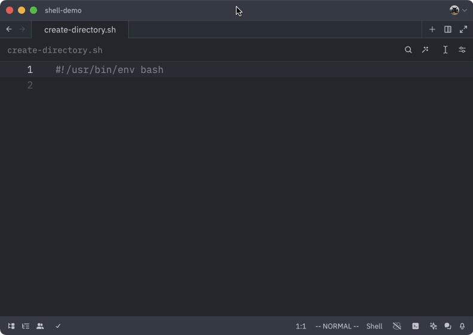

# shell.zed

> **Note:**
>
> The [merge request](https://github.com/zed-industries/extensions/pull/1078) to add this plugin to the Zed extension store was
> closed. You are free to install it as a dev extension, but it won't be
> officially merged in.
>
> If you're looking for shell support in Zed, you can try [Basher](https://github.com/d1y/bash.zed).
>
> Feel free to submit issues, merge requests, or fork, but since I don't use Zed
> anymore, my help will be limited.

<p align="center">
  
</p>

Support for Bash, POSIX Shell, and ZSH.

- Tree Sitter: [tree-sitter-bash](https://github.com/tree-sitter/tree-sitter-bash)
- Language Server: [bash-language-server](https://github.com/bash-lsp/bash-language-server)

## Features

- [Smart LSP Detection](#smart-lsp-detection)
  - Auto-detects installed language server
  - Falls back to installed language server if offline
- Syntax Highlighting
  - Adapted from [nvim-treesitter](https://github.com/nvim-treesitter/nvim-treesitter/blob/master/queries/bash/highlights.scm)
  - Highlights command flags
- Comprehensive Bracket Jumping
- Smart Indentation
- Linting[^1] and Formatting (when dependencies are installed)

## Linting and Formatting

Linting and formatting is handled through [bash-language-server
](https://github.com/bash-lsp/bash-language-server). For more information,
please view their [dependencies documentation
](https://github.com/bash-lsp/bash-language-server?tab=readme-ov-file#dependencies).

In short, you will need to install the following:

- `shellcheck` - Linting
- `shfmt` - Formatting

### Linux Installation

```bash
sudo apt-get install shellcheck shfmt
```

### Homebrew Installation

```bash
brew install shellcheck shfmt
```

[^1]: Linting is only available for Bash and POSIX Shell.

## Smart LSP Detection

When `bash-language-server` is installed and in your `$PATH`, it will be used as
the language server automatically without checking the internet!

If you're offline and this plugin has already installed a version of the
language server, it will use that version instead after it fails updating one
time.

Otherwise, it will check the internet for the latest version of the langauge
server and install it for you.
